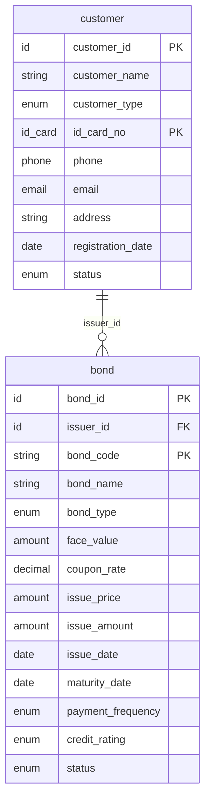
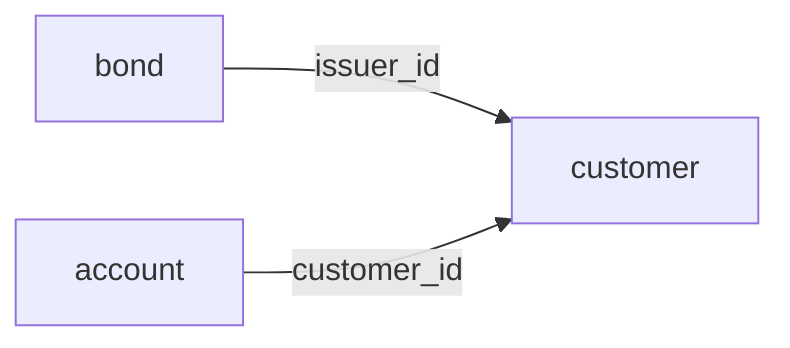

# 🎨 Fin-Data-Maker 新功能指南

**版本**: v2.1.0
**发布日期**: 2025-11-14

本文档介绍Fin-Data-Maker v2.1.0中新增的三大核心功能：

1. **表间依赖关系分析** - 自动分析表之间的依赖关系
2. **数据关系图可视化** - 生成ER图和依赖关系图
3. **实时进度监控** - 实时跟踪数据生成过程

---

## 📊 功能1: 表间依赖关系分析

### 功能概述

依赖关系分析器能够自动分析表之间的外键依赖关系，提供以下功能：

- ✅ 自动检测循环依赖
- ✅ 生成拓扑排序（数据生成顺序）
- ✅ 计算依赖层级
- ✅ 识别根表和叶子表
- ✅ 生成完整依赖链
- ✅ 生成详细分析报告

### 使用示例

```python
from src.analysis.dependency_analyzer import DependencyAnalyzer
from src.financial.schemas import (
    create_customer_table,
    create_account_table,
    create_bond_table,
)

# 创建表定义
tables = [
    create_customer_table(),
    create_account_table(),
    create_bond_table(),
]

# 创建依赖分析器
analyzer = DependencyAnalyzer(tables)

# 1. 生成分析报告
report = analyzer.generate_report()
print(report)

# 2. 获取推荐的生成顺序
order = analyzer.get_generation_order()
print("推荐顺序:", order)
# 输出: ['customer', 'account', 'bond']

# 3. 检测循环依赖
cycles = analyzer.detect_cycles()
if cycles:
    print("警告：发现循环依赖:", cycles)
else:
    print("✓ 无循环依赖")

# 4. 获取依赖层级
levels = analyzer.get_dependency_levels()
print("依赖层级:", levels)
# 输出: {'customer': 0, 'account': 1, 'bond': 1}

# 5. 获取根表（无依赖）
root_tables = analyzer.get_root_tables()
print("根表:", root_tables)
# 输出: ['customer']

# 6. 分析单个表
analysis = analyzer.analyze_table('bond')
print(f"Bond表依赖于: {analysis['dependencies']}")
print(f"Bond表被依赖: {analysis['dependents']}")
print(f"依赖链: {' → '.join(analysis['dependency_chain'])}")
```

### API参考

#### DependencyAnalyzer类

**方法列表**:

| 方法 | 说明 | 返回值 |
|------|------|--------|
| `detect_cycles()` | 检测循环依赖 | List[CyclicDependency] |
| `topological_sort()` | 拓扑排序 | Tuple[List[str], bool] |
| `get_generation_order()` | 获取推荐生成顺序 | List[str] |
| `get_dependency_levels()` | 获取依赖层级 | Dict[str, int] |
| `get_root_tables()` | 获取根表 | List[str] |
| `get_leaf_tables()` | 获取叶子表 | List[str] |
| `get_dependency_chain(table_name)` | 获取完整依赖链 | List[str] |
| `analyze_table(table_name)` | 分析单个表 | Dict |
| `generate_report()` | 生成分析报告 | str |

### 输出示例

```
============================================================
表依赖关系分析报告
============================================================

表总数: 5
依赖关系数: 3

✅ 未检测到循环依赖

推荐的数据生成顺序:
  1. customer
  2. derivative
  3. account
  4. bond
  5. fund

依赖层级分布:
  层级 0: customer, derivative
  层级 1: account, bond, fund

根表（无依赖）: customer, derivative
叶子表（无依赖方）: account, bond, derivative, fund

详细依赖关系:
  account 依赖于: customer
  bond 依赖于: customer
  fund 依赖于: customer

============================================================
```

---

## 🎨 功能2: 数据关系图可视化

### 功能概述

关系可视化器能够生成多种格式的ER图和依赖关系图：

- ✅ **Graphviz DOT格式** - 可渲染为PNG/SVG/PDF图片
- ✅ **Mermaid格式** - 可在Markdown中直接展示
- ✅ **PlantUML格式** - 企业级UML图表
- ✅ 显示字段详情和类型
- ✅ 高亮主键和外键
- ✅ 简化依赖关系图

### 使用示例

```python
from src.visualization.relationship_visualizer import (
    RelationshipVisualizer,
    VisualizationFormat
)
from src.financial.schemas import create_customer_table, create_bond_table

# 创建表定义
tables = [
    create_customer_table(),
    create_bond_table(),
]

# 创建可视化器
visualizer = RelationshipVisualizer(tables)

# 1. 生成Mermaid格式ER图
mermaid_content = visualizer.generate_mermaid(
    output_file='output/er_diagram.mmd',
    show_fields=True,
    show_field_types=True
)

# 2. 生成Graphviz DOT格式ER图
dot_content = visualizer.generate_dot(
    output_file='output/er_diagram.dot',
    show_fields=True,
    show_field_types=True,
    highlight_keys=True
)

# 3. 生成PlantUML格式ER图
plantuml_content = visualizer.generate_plantuml(
    output_file='output/er_diagram.puml',
    show_fields=True
)

# 4. 生成简化依赖关系图
dep_content = visualizer.generate_dependency_diagram(
    output_file='output/dependency.mmd',
    format=VisualizationFormat.MERMAID
)

# 5. 渲染DOT文件为图片（需要安装graphviz）
try:
    visualizer.render_dot_to_image(
        dot_content,
        'output/er_diagram',
        format='png'
    )
    print("✓ 图片已生成: output/er_diagram.png")
except ImportError:
    print("⚠️  需要安装: pip install graphviz")
```

### 生成的ER图示例

#### Mermaid格式



#### 依赖关系图（Mermaid）



### 在线查看工具

| 格式 | 在线工具 |
|------|---------|
| Mermaid (.mmd) | https://mermaid.live/ |
| Graphviz (.dot) | https://dreampuf.github.io/GraphvizOnline/ |
| PlantUML (.puml) | http://www.plantuml.com/plantuml/uml/ |

### API参考

#### RelationshipVisualizer类

**方法列表**:

| 方法 | 说明 | 参数 |
|------|------|------|
| `generate_dot()` | 生成DOT格式 | show_fields, show_field_types, highlight_keys |
| `generate_mermaid()` | 生成Mermaid格式 | show_fields, show_field_types |
| `generate_plantuml()` | 生成PlantUML格式 | show_fields, show_field_types |
| `generate_dependency_diagram()` | 生成简化依赖图 | format |
| `render_dot_to_image()` | 渲染DOT为图片 | dot_content, output_file, format |
| `generate()` | 统一生成接口 | format, output_file, **kwargs |

---

## 📈 功能3: 实时进度监控

### 功能概述

进度监控器提供数据生成过程的实时跟踪：

- ✅ 实时进度更新
- ✅ 事件回调机制
- ✅ 预计剩余时间（ETA）
- ✅ 批次完成跟踪
- ✅ 验证过程监控
- ✅ 错误和取消处理
- ✅ 历史记录保存
- ✅ 进度摘要报告

### 使用示例

```python
from src.core.app import DataMakerApp
from src.core.progress_monitor import (
    ProgressMonitor,
    console_callback,
    simple_progress_bar_callback
)
from src.financial.schemas import create_customer_table

# 创建应用
app = DataMakerApp(seed=42)
app.add_table(create_customer_table())

# 创建进度监控器
monitor = ProgressMonitor()

# 添加回调函数
monitor.add_callback(simple_progress_bar_callback)  # 进度条
# monitor.add_callback(console_callback)  # 详细日志

# 自定义回调函数
def custom_callback(event):
    print(f"[{event.event_type.value}] {event.message}")

monitor.add_callback(custom_callback)

# 开始监控
monitor.start(total_items=100, table_name='customer')

# 模拟数据生成
for i in range(10):
    # 生成数据...
    data = app.generate_data("customer", count=10, validate=False)[0]

    # 更新进度
    monitor.batch_completed(batch_size=10, batch_num=i+1)
    monitor.update((i+1)*10, f"已生成 {(i+1)*10} 条记录")

# 验证数据
monitor.validation_started(100)
# 执行验证...
monitor.validation_completed(100, is_valid=True)

# 完成
monitor.complete("数据生成完成！")

# 获取进度摘要
print(monitor.get_summary())
```

### 进度条输出示例

```
开始生成客户数据...
进度: |████████████████████████████████████████| 100.0% 已生成 100 条记录

验证客户数据...

关键事件摘要:
[08:04:33] table_started: 开始生成表 customer，总计 100 条记录
[08:04:34] table_completed: 表 customer 生成完成，共 100 条记录
[08:04:34] validation_started: 开始验证数据，共 100 条记录
[08:04:34] validation_completed: 数据验证完成：通过

==================================================
进度摘要
==================================================
状态: 已停止
当前表: customer
进度: 100/100 (100.0%)
已用时间: 1.2秒
==================================================
```

### 进度事件类型

| 事件类型 | 说明 | 触发时机 |
|---------|------|---------|
| STARTED | 开始生成 | 调用start()时 |
| PROGRESS | 进度更新 | 调用update()时 |
| TABLE_STARTED | 表生成开始 | 调用table_started()时 |
| TABLE_COMPLETED | 表生成完成 | 调用table_completed()时 |
| BATCH_COMPLETED | 批次完成 | 调用batch_completed()时 |
| VALIDATION_STARTED | 验证开始 | 调用validation_started()时 |
| VALIDATION_COMPLETED | 验证完成 | 调用validation_completed()时 |
| COMPLETED | 全部完成 | 调用complete()时 |
| ERROR | 错误发生 | 调用error()时 |
| CANCELLED | 取消操作 | 调用cancel()时 |

### API参考

#### ProgressMonitor类

**主要方法**:

| 方法 | 说明 | 参数 |
|------|------|------|
| `add_callback(callback)` | 添加回调函数 | callback: Callable[[ProgressEvent], None] |
| `start(total_items, table_name)` | 开始监控 | total_items: int, table_name: str |
| `update(completed, message)` | 更新进度 | completed: int, message: str |
| `table_started(name, total)` | 表开始 | name: str, total: int |
| `table_completed(name, total)` | 表完成 | name: str, total: int |
| `batch_completed(size, num)` | 批次完成 | size: int, num: int |
| `validation_started(count)` | 验证开始 | count: int |
| `validation_completed(count, is_valid, error_count)` | 验证完成 | count: int, is_valid: bool, error_count: int |
| `complete(message)` | 完成 | message: str |
| `error(message, exception)` | 报告错误 | message: str, exception: Exception |
| `cancel()` | 取消操作 | 无 |
| `get_current_progress()` | 获取当前进度 | 返回: Dict |
| `get_summary()` | 获取进度摘要 | 返回: str |

#### 预定义回调函数

```python
# 1. 控制台输出回调
from src.core.progress_monitor import console_callback
monitor.add_callback(console_callback)

# 2. 简单进度条回调
from src.core.progress_monitor import simple_progress_bar_callback
monitor.add_callback(simple_progress_bar_callback)

# 3. 自定义回调
def my_callback(event):
    if event.event_type == ProgressEventType.COMPLETED:
        print(f"✅ 完成！用时 {event.elapsed_time:.1f} 秒")

monitor.add_callback(my_callback)
```

---

## 🚀 完整使用示例

### 综合示例：生成数据并可视化

```python
from src.core.app import DataMakerApp
from src.financial.schemas import (
    create_customer_table,
    create_bond_table,
    create_fund_table,
)
from src.analysis.dependency_analyzer import DependencyAnalyzer
from src.visualization.relationship_visualizer import (
    RelationshipVisualizer,
    VisualizationFormat
)
from src.core.progress_monitor import ProgressMonitor, simple_progress_bar_callback

# 1. 创建表定义
tables = [
    create_customer_table(),
    create_bond_table(),
    create_fund_table(),
]

# 2. 分析依赖关系
analyzer = DependencyAnalyzer(tables)
print(analyzer.generate_report())

# 获取推荐的生成顺序
generation_order = analyzer.get_generation_order()
print(f"\n推荐生成顺序: {' → '.join(generation_order)}")

# 3. 生成可视化图表
visualizer = RelationshipVisualizer(tables)

# 生成ER图
visualizer.generate_mermaid('output/er_diagram.mmd', show_fields=True)
print("✓ ER图已生成: output/er_diagram.mmd")

# 生成依赖关系图
visualizer.generate_dependency_diagram(
    'output/dependency.mmd',
    format=VisualizationFormat.MERMAID
)
print("✓ 依赖图已生成: output/dependency.mmd")

# 4. 按推荐顺序生成数据（带进度监控）
app = DataMakerApp(seed=42)
for table in tables:
    app.add_table(table)

monitor = ProgressMonitor()
monitor.add_callback(simple_progress_bar_callback)

generated_data = {}

for table_name in generation_order:
    print(f"\n生成 {table_name} 数据...")

    monitor.table_started(table_name, 50)

    # 获取关联数据
    related_data = {}
    deps = analyzer.graph.get_dependencies(table_name)
    if deps:
        for dep in deps:
            if dep in generated_data:
                # 提取ID列表
                id_field = f"{dep}_id"
                related_data[dep] = [item.get(id_field) for item in generated_data[dep]]

    # 生成数据
    if related_data:
        data, report = app.generate_with_relations(
            table_name,
            count=50,
            related_data=related_data
        )
    else:
        data, report = app.generate_data(table_name, count=50)

    generated_data[table_name] = data

    monitor.table_completed(table_name, 50)

    # 导出数据
    app.export_to_csv(data, table_name, f'output/{table_name}.csv')
    print(f"✓ 已导出: output/{table_name}.csv")

monitor.complete("所有数据生成完成！")

print("\n" + "="*60)
print("✅ 任务完成！")
print("="*60)
print(f"生成的数据文件: output/*.csv")
print(f"可视化图表: output/*.mmd")
print("\n查看ER图: https://mermaid.live/")
print("="*60)
```

---

## 📊 运行演示脚本

我们提供了一个完整的演示脚本，展示所有新功能的使用：

```bash
# 运行完整演示
python examples/visualization_example.py
```

演示脚本将执行以下操作：

1. ✅ 分析5个表的依赖关系
2. ✅ 生成完整的分析报告
3. ✅ 创建ER图（Mermaid, DOT, PlantUML）
4. ✅ 创建依赖关系图
5. ✅ 模拟数据生成过程并实时监控进度
6. ✅ 显示关键事件摘要

---

## 🧪 运行单元测试

新功能包含34个单元测试，覆盖所有主要功能：

```bash
# 运行测试
PYTHONPATH=. python tests/test_new_features.py
```

测试覆盖：
- ✅ 依赖分析器：12个测试
- ✅ 关系可视化器：7个测试
- ✅ 进度监控器：15个测试

---

## 🎯 最佳实践

### 1. 依赖关系分析

```python
# ✅ 推荐做法
analyzer = DependencyAnalyzer(tables)

# 在生成数据前检查循环依赖
cycles = analyzer.detect_cycles()
if cycles:
    print("错误：存在循环依赖！")
    for cycle in cycles:
        print(f"  {cycle}")
    sys.exit(1)

# 按推荐顺序生成数据
for table_name in analyzer.get_generation_order():
    # 生成数据...
    pass
```

### 2. 关系可视化

```python
# ✅ 推荐做法

# 用于文档：使用Mermaid格式（可直接嵌入Markdown）
visualizer.generate_mermaid(
    'docs/er_diagram.mmd',
    show_fields=True,
    show_field_types=True
)

# 用于演示：渲染为图片
dot_content = visualizer.generate_dot(show_fields=True)
visualizer.render_dot_to_image(dot_content, 'output/er', format='png')

# 用于分析：生成简化依赖图
visualizer.generate_dependency_diagram(
    'output/deps.mmd',
    format=VisualizationFormat.MERMAID
)
```

### 3. 进度监控

```python
# ✅ 推荐做法

# 为不同场景使用不同的回调
if sys.stdout.isatty():
    # 交互式终端：使用进度条
    monitor.add_callback(simple_progress_bar_callback)
else:
    # 非交互式环境（如CI）：使用详细日志
    monitor.add_callback(console_callback)

# 添加自定义业务逻辑
def business_callback(event):
    if event.event_type == ProgressEventType.ERROR:
        send_alert(event.message)  # 发送告警
    elif event.event_type == ProgressEventType.COMPLETED:
        save_statistics(event)  # 保存统计数据

monitor.add_callback(business_callback)
```

---

## 📦 依赖要求

新功能的额外依赖（可选）：

```bash
# 用于渲染DOT文件为图片（可选）
pip install graphviz

# 系统依赖（Ubuntu/Debian）
sudo apt-get install graphviz

# 系统依赖（macOS）
brew install graphviz

# 系统依赖（Windows）
# 下载安装：https://graphviz.org/download/
```

**注意**：即使不安装graphviz，也可以使用在线工具查看生成的DOT/Mermaid/PlantUML文件。

---

## 🐛 故障排查

### 问题1：导入错误

```python
ModuleNotFoundError: No module named 'src.analysis'
```

**解决方案**：
```bash
# 确保设置了PYTHONPATH
export PYTHONPATH=/path/to/Fin-Data-Maker:$PYTHONPATH
python your_script.py

# 或在脚本中添加
import sys
sys.path.insert(0, '/path/to/Fin-Data-Maker')
```

### 问题2：循环依赖错误

```python
ValueError: 存在循环依赖，无法确定生成顺序
```

**解决方案**：
```python
# 检查表定义，移除循环引用
analyzer = DependencyAnalyzer(tables)
cycles = analyzer.detect_cycles()
print("发现的循环依赖:", cycles)

# 修改表结构，打破循环
```

### 问题3：Graphviz渲染失败

```python
ImportError: 需要安装graphviz库
```

**解决方案**：
```bash
# 方案1：安装graphviz（推荐）
pip install graphviz

# 方案2：使用在线工具
# 将.dot文件上传到 https://dreampuf.github.io/GraphvizOnline/
```

---

## 📚 更多资源

- **示例脚本**: `examples/visualization_example.py`
- **单元测试**: `tests/test_new_features.py`
- **API文档**: 查看各模块的docstring
- **在线工具**:
  - Mermaid: https://mermaid.live/
  - Graphviz: https://dreampuf.github.io/GraphvizOnline/
  - PlantUML: http://www.plantuml.com/plantuml/uml/

---

## 🎉 总结

v2.1.0新增的三大功能为Fin-Data-Maker带来了以下能力：

1. **智能依赖分析** - 自动识别表依赖关系，避免数据生成错误
2. **直观可视化** - 生成专业的ER图和依赖图，便于文档和演示
3. **实时监控** - 跟踪数据生成进度，提供更好的用户体验

这些功能让Fin-Data-Maker从单纯的数据生成工具，进化为一个完整的数据工程解决方案！

---

**文档版本**: v1.0
**最后更新**: 2025-11-14
**反馈**: 如有问题或建议，请提交Issue
